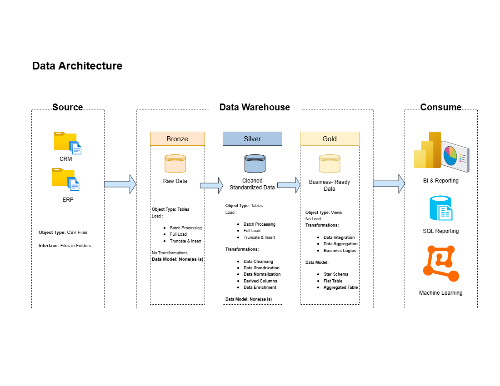

# Data Warehouse and Analytics Project

Welcome to the **Data Warehouse and Analytics Project** repository!
This project demonstrates a comprehensive data warehousing and analytics solution, from building a data warehouse to generating actionable insights. Designed as a portfolio project highlights industry best practices in data engineering and analytics. Credit to Mr.Baraa for this wonderful project!

## 📋 Project Requirements
### Building the Data Warehouse (Data Engineering)

#### Objective
Develop a modern data warehouse using SQL Server to consolidate sales data, enabling analytical reporting and informed decision-making.

#### Specifications
- **Data Sources**: Import data from two source systems (ERP and CRM) provided as CSV files.
- **Data Quality**: Cleanse and resolve data quality issues prior to analysis.
- **Integration**: Combine sources into a single, user-friendly data model designed for analytical queries.
- **Scope**: Focus on the dataset only; historization of data is not required.
- **Documentation**: Provide clear documentation of the data model to support both business stakeholders and analytics teams.

### BI: Analytics & Reporting (Data Analytics)

#### Objective
Develop SQL-based analytics to deliver detailed insights into:
- **Customer Behavior**
- **Product Performance**
- **Sales Trends**
#### These insights empower stakeholders with key business metrics, enabling strategic decision-making.
---
### 🏗️ Data Architecture
The data architecture of this project follows Medallion Architecture **Bold**, **Silver**, and **Gold** layers:

1. **Bronze Layer**: Store data as is from the source systems. Data is ingested from teh CSV Files into SQL Server Database.
2. **Silver Layer**: This layer includes data cleansing, standardization, and normalization process to prepare data for analytics.
3. **Gold Layer**: Houses business-ready data modeled into a star schema required for reporting and analytics.
---

### 🛡️ License
This project is licensed under the [MIT License](Licence). Free to use, modify, and share this project with proper attribution.

## 🐦‍🔥 About Me
Hello there! I'm **Micka Corpin**, also known as **Data With Miks**. I'm a passionate newbie to learn more about data engineering. 
